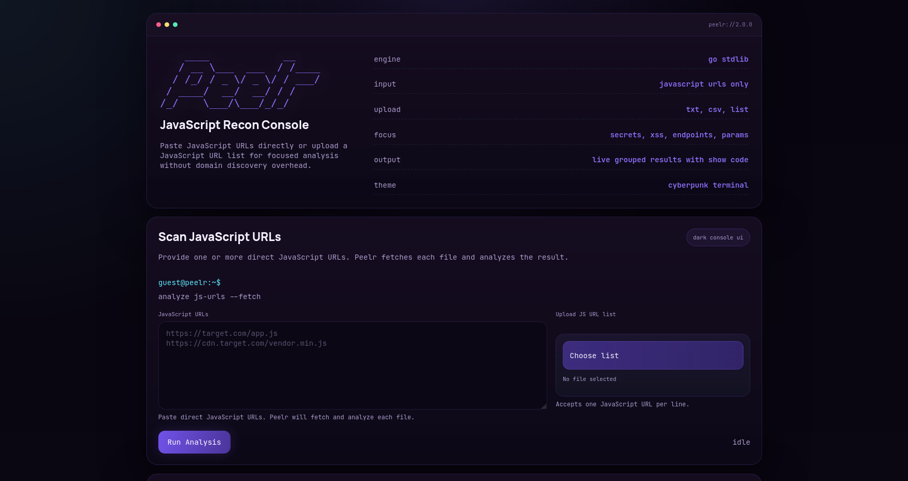
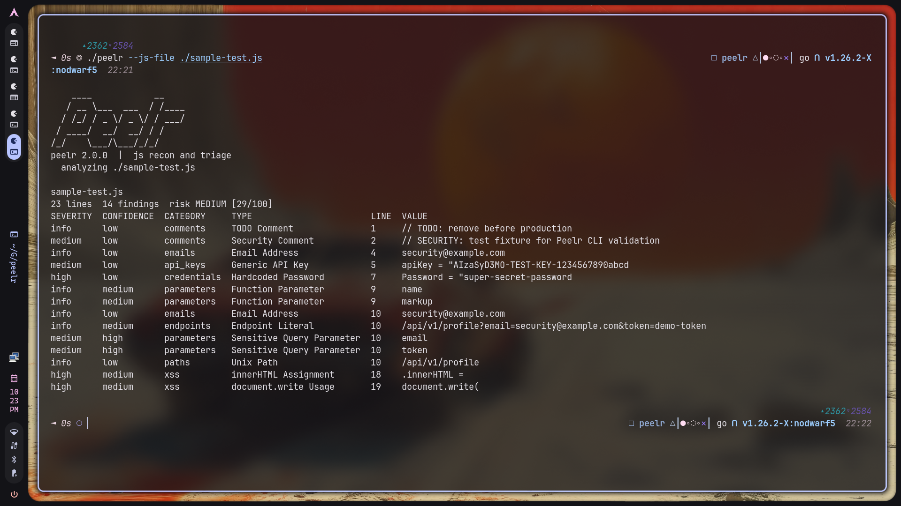

# Peelr

**Peelr is a JavaScript URL analysis and triage tool for security research.**

You give Peelr direct JavaScript URLs or local JavaScript files. It fetches or reads the source, analyzes the code, and highlights the findings worth reviewing first.

Current release: `2.0.0`

[](https://go.dev/)
[](#installation)
[](LICENSE)
[](#installation)

## Why Peelr

When you already have JavaScript URLs, the hard part is usually not collection. The hard part is triage.

Large frontend bundles often contain:

- exposed secrets and tokens
- dangerous DOM sinks
- internal API routes
- sensitive parameters
- filesystem paths
- comments that reveal implementation details

Peelr is built for that workflow. It is intentionally focused:

- no domain discovery
- no crawler logic
- no archive expansion
- no browser automation

It is meant for the moment where you already have `.js` URLs and want fast answers about what deserves attention first.

## Security Detection

### API Keys

Peelr detects:

- AWS access key patterns
- Google API keys
- GitHub tokens
- Stripe keys
- PayPal tokens
- Slack tokens and webhook-like strings
- Firebase references and client-side keys
- JWT tokens
- SendGrid keys
- generic API key and access token patterns

### Credentials

Peelr looks for:

- hardcoded passwords
- hardcoded usernames
- bearer tokens
- basic auth headers
- database connection strings
- private key blocks

### Email Addresses

Peelr extracts email addresses found in JavaScript code and applies stricter validation so strings that are really URL fragments with `@` do not get treated as normal email findings.

### XSS Vulnerabilities

Peelr identifies client-side patterns that commonly lead to Cross-Site Scripting issues, including:

- `innerHTML` assignments
- `outerHTML` assignments
- `document.write()` usage
- `eval()` usage
- `new Function()`
- `insertAdjacentHTML`
- `srcdoc`
- React `dangerouslySetInnerHTML`
- jQuery HTML injection points

### XSS Functions

Peelr also flags function patterns and DOM usage that may become XSS sinks depending on how data reaches them. The output is meant to help you prioritize manual review, not claim exploitability automatically.

## API & Endpoint Discovery

Peelr extracts:

- API endpoints referenced in `fetch()`
- `axios` request paths
- `XMLHttpRequest` `.open()` targets
- jQuery AJAX URLs
- endpoint literals
- base paths and versioned routes
- network request hints across the file

## Parameter Analysis

Peelr finds:

- URL query parameters such as `?key=` and `&email=`
- function parameters
- sensitive parameters such as `token`, `key`, `secret`, `password`, and related names

## Path & Directory Discovery

Peelr extracts:

- relative paths
- absolute paths
- filesystem-like references
- embedded file and route references

## Code Analysis

Peelr highlights:

- interesting comments like `TODO`, `FIXME`, `SECURITY`, `HACK`, `BUG`, and `WARNING`
- suspicious comments containing sensitive or security-relevant language

## Advanced Features

- Multiple File Analysis: analyze one or many JavaScript URLs in a single run
- Local JavaScript Analysis: analyze `.js` files directly without fetching them from the network
- File Upload: upload a text file with multiple JavaScript URLs in the web UI
- Live Results: view results as they are processed
- Code Context: inspect matching code through `Show Code`
- Filterable Results: filter by category, severity, and search text
- Modern UI: dark terminal-style interface optimized for large result sets
- Reduced False Positives: noise controls and stricter matching to reduce junk findings

## Screenshots





## Installation

Requirement: `Go 1.21+`

### Linux

Ubuntu or Debian:

```bash
sudo apt install golang-go
```

Arch Linux:

```bash
sudo pacman -S go
```

### macOS

```bash
brew install go
```

### Build

```bash
git clone https://github.com/ibfavas/peelr.git
cd peelr
go build -o peelr ./cmd/peelr
```

Peelr uses the Go standard library only.

## Usage

### Run the Web UI

```bash
./peelr
```

Default address:

```text
http://127.0.0.1:8080
```

Custom bind address and port:

```bash
./peelr --listen 0.0.0.0 --port 9000
```

### Analyze a Single JavaScript URL

```bash
./peelr --url https://target.com/app.js
```

### Analyze a File Containing JavaScript URLs

```bash
./peelr --file js_urls.txt
```

Expected format:

```text
https://example.com/app.js
https://cdn.example.com/vendor.js
https://static.example.com/runtime.js
```

### Analyze Local JavaScript Files Directly

```bash
./peelr --js-file ./sample-test.js
./peelr --js-file ./dist
./peelr --js-file ./a.js,./b.js
```

### Pipe JavaScript URLs In

```bash
cat js_urls.txt | ./peelr
```

## Web UI Guide

The web UI is focused on direct JavaScript URL analysis only.

You can:

- paste one or more JavaScript URLs
- upload a text file containing JavaScript URLs
- run an analysis job
- monitor progress live while files are processed
- filter results by category
- filter results by severity
- search across titles, values, notes, and context
- opt into lower-signal findings only when needed
- expand more files and more findings on demand

### Web UI Workflow

1. Start Peelr with `./peelr`.
2. Open `http://127.0.0.1:8080`.
3. Paste JavaScript URLs or upload a list file.
4. Click `Run Analysis`.
5. Review the stats, runtime progress, and grouped findings.
6. Use category and severity filters to narrow the result set.
7. Open `Show Code` on findings that need direct inspection.

## CLI Output Formats

### Table

```bash
./peelr --url https://target.com/app.js --format table
```

### JSON

```bash
./peelr --url https://target.com/app.js --format json
```

### Plain

```bash
./peelr --url https://target.com/app.js --format plain
```

## Example CLI Output

The repository includes a local sample file at [sample-test.js](sample-test.js).

Run it with:

```bash
./peelr --js-file ./sample-test.js
```

Example output:

```text
sample-test.js
23 lines  14 findings  risk MEDIUM [29/100]
SEVERITY  CONFIDENCE  CATEGORY     TYPE                       LINE  VALUE
info      low         comments     TODO Comment               1     // TODO: remove before production
medium    low         comments     Security Comment           2     // SECURITY: test fixture for Peelr CLI validation
info      low         emails       Email Address              4     security@example.com
medium    low         api_keys     Generic API Key            5     apiKey = "AIzaSyD3MO-TEST-KEY-1234567890abcd
high      low         credentials  Hardcoded Password         7     Password = "super-secret-password
info      medium      parameters   Function Parameter         9     name
info      medium      parameters   Function Parameter         9     markup
info      low         emails       Email Address              10    security@example.com
info      medium      endpoints    Endpoint Literal           10    /api/v1/profile?email=security@example.com&token=demo-token
medium    high        parameters   Sensitive Query Parameter  10    email
medium    high        parameters   Sensitive Query Parameter  10    token
info      low         paths        Unix Path                  10    /api/v1/profile
high      medium      xss          innerHTML Assignment       18    .innerHTML =
high      medium      xss          document.write Usage       19    document.write(
```

This sample demonstrates that Peelr can surface multiple categories in one pass:

- comments
- email addresses
- API keys
- credentials
- endpoints
- sensitive parameters
- paths
- XSS sinks

## History and Diffing

Peelr stores scan history in:

```text
~/.peelr/history/
```

### Show history

```bash
./peelr --history
```

### Diff against the previous scan

```bash
./peelr --url https://target.com/app.js --diff
```

### Clear stored history

```bash
./peelr --clear-history
```

## HTTP API

Peelr uses a job-based API for the web UI.

### Create a job

Send JavaScript URLs in the `urls` form field, or upload a text file with one JavaScript URL per line.

Example:

```bash
curl -X POST http://127.0.0.1:8080/api/jobs \
  -F 'mode=js' \
  -F 'urls=https://target.com/app.js
https://target.com/vendor.js'
```

Response:

```json
{"job_id":"..."}
```

### Poll a job

```bash
curl http://127.0.0.1:8080/api/jobs/JOB_ID
```

### Read history

```bash
curl http://127.0.0.1:8080/api/history
```

## Technical Details

### Architecture

- Backend: Go with the standard library
- Frontend: vanilla JavaScript, HTML, and CSS
- Analysis engine: pattern-based JavaScript inspection with noise reduction and result scoring

### Server-Side Processing

All analysis is performed server-side for:

- consistency across browsers
- lower client-side overhead
- safer handling of large JavaScript files
- easier history and diff support

### Current Limits

| Limit | Value |
|---|---|
| Maximum fetched source size | `20 MB` |
| Maximum JavaScript URLs per web job | `250` |
| URL fetch timeout | `20s` |

## Risk Scoring

Each analyzed JavaScript file gets a `0-100` risk score and a label.

| Score | Label |
|---|---|
| `80-100` | `critical` |
| `55-79` | `high` |
| `28-54` | `medium` |
| `10-27` | `low` |
| `0-9` | `minimal` |

Risk is based on:

- finding severity
- finding confidence
- finding volume

## Confidence Levels

| Confidence | Meaning |
|---|---|
| `high` | strong pattern with relatively low false positive rate |
| `medium` | useful signal that still needs manual validation |
| `low` | broad heuristic or context with higher noise potential |

## Performance Notes

To keep the web UI responsive on noisy scans, Peelr:

- hides low and info findings by default
- sorts results by risk and finding density
- renders a limited number of result files at first
- renders only the first visible findings per file at first
- expands more files and more findings on demand
- trims long code snippets in the default pass
- debounces text search
- avoids unnecessary rerender churn when job state has not materially changed

If you are working with very large URL lists, prefer:

- splitting very large batches into smaller runs
- using JSON output for automation
- enabling lower-signal findings only after the higher-signal pass

## Use Cases

- Bug Bounty Hunting: find exposed API keys, credentials, and risky sinks quickly
- Security Audits: identify vulnerable client-side patterns in JavaScript-heavy applications
- Code Review: automate repetitive reconnaissance and triage
- Asset Discovery: map API endpoints, routes, and path references
- Penetration Testing: surface likely attack vectors for manual validation

## What Peelr Is and Isn't

| Peelr does | Peelr does not |
|---|---|
| Analyze direct JavaScript URLs | Discover JavaScript from domains |
| Analyze local JavaScript files | Crawl websites like a browser |
| Highlight secrets and dangerous client-side patterns | Prove exploitability |
| Preserve code context for fast review | Replace manual validation |
| Prioritize high-signal findings | Eliminate all false positives |

## Contributing

Contributions are welcome.

Typical workflow:

1. Fork the repository.
2. Create a feature branch.
3. Make the change.
4. Run `go build ./...`.
5. Open a pull request.

## Safety and Ethics

Use Peelr only on systems you own or have explicit written permission to test.

This tool is intended for:

- authorized security reviews
- internal application testing
- bug bounty recon where program rules allow it
- education in secure code review and reconnaissance

Unauthorized access to computer systems is illegal.

## License

See [MIT LICENSE](LICENSE).
